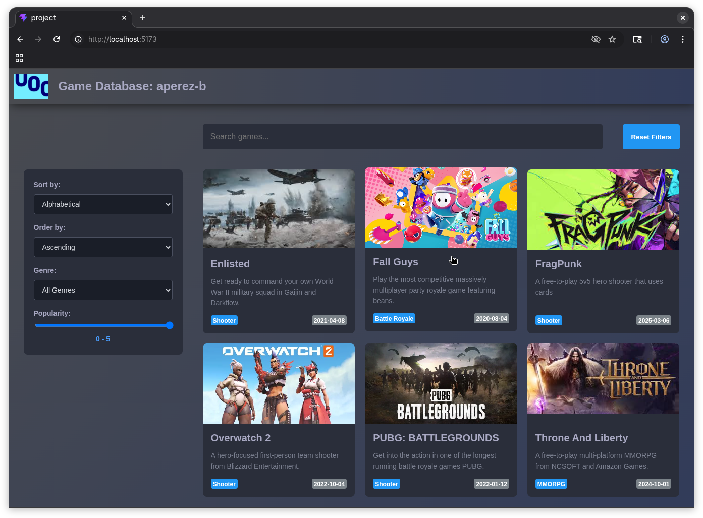
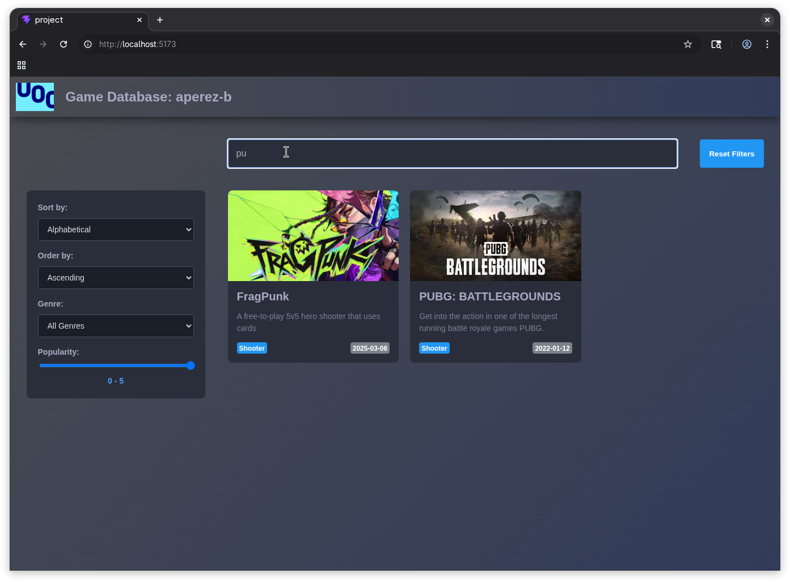
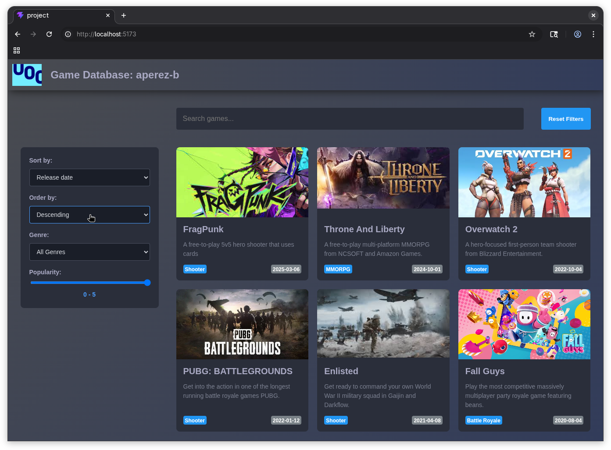
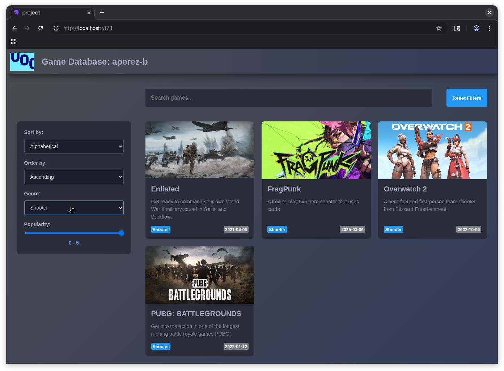
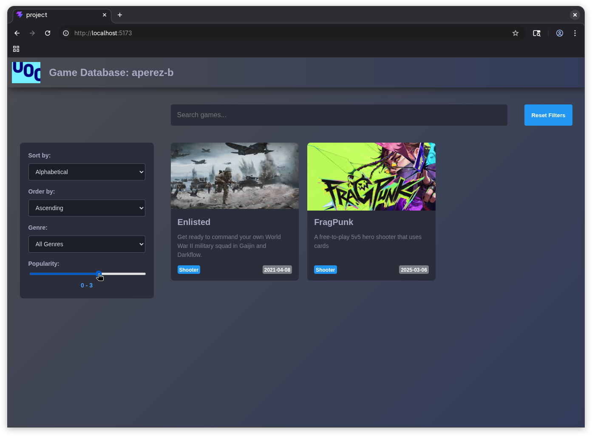



## Part 1

:::{.callout-tip}

In this first part it is possible to create a quick Vue.js project and create and place the new component
`TaskProgress.vue` inside `src/components/` in order to test it live.

In my project, the `App.vue` file looks like this:

```vue
<script setup lang="ts">
import TaskProgress from './components/TaskProgress.vue'
</script>

<template>
  <TaskProgress taskName="Compile report" totalSteps="5" />
</template>
```

:::

### Exercise 1

```vue
<template>
  <div>
    <h3>{{ taskName }}</h3>
    <p>Step {{ currentStep }} of {{ totalSteps }}</p>
  </div>
</template>

<script>
export default {
  name: 'TaskProgress',
  props: {
    taskName: String,
    totalSteps: String
  },
  data() {
    return {
      currentStep: 0
    };
  }
};
</script>
```

The component uses the <template> block to define the visual structure, rendering the dynamic values inside double curly braces {{ }} for text interpolation. The props object registers taskName and totalSteps as strings types so they can safely receive data from a parent component [@vue-components;@zaustre2024].

### Exercise 2

```vue
<template>
  <div>
    <h3>{{ taskName }}</h3>
    <p>Step {{ currentStep }} of {{ totalSteps }}</p>
    <button @click="previousStep">Previous step</button>
    <button @click="nextStep">Next step</button>
    <br>
    <small>Updated {{ updateCount }} times</small>
  </div>
</template>

<script>
export default {
  name: 'TaskProgress',
  props: {
    taskName: String,
    totalSteps: String
  },
  data() {
    return {
      currentStep: 0,
      updateCount: 0
    };
  },
  methods: {
    nextStep() {
      if (this.currentStep < parseInt(this.totalSteps, 10)) {
        this.currentStep++;
        this.updateCount++;
      }
    },
    previousStep() {
      if (this.currentStep > 0) {
        this.currentStep--;
        this.updateCount++;
      }
    }
  }
};
</script>
```

The new code adds the previous and next step buttons, as well as small text to display the number of times a step change has occurred. The main logic is shown inside the `script` tag in the above code. In it the `nextStep` and `previousStep` methods update the `currentStep` and `updateCount` variables only if they are within the specified range (0 to whatever is specified by `totalSteps`, which is converted to base 10 for int comparison).

### Exercise 3

```vue
<template>
  <div>
    <h3>{{ taskName }}</h3>
    <p>Step {{ currentStep }} of {{ totalSteps }}</p>
    
    <p v-if="currentStep === 0">Task not started</p>
    <p v-else-if="currentStep == totalSteps">Task completed</p>
    <p v-else>Task in progress...</p>
    
    <button @click="previousStep">Previous step</button>
    <button @click="nextStep">Next step</button>
    
    <br>
    <small>Updated {{ updateCount }} times</small>
  </div>
</template>

<script>
export default {
  name: 'TaskProgress',
  props: {
    taskName: String,
    totalSteps: String
  },
  data() {
    return {
      currentStep: 0,
      updateCount: 0
    };
  },
  methods: {
    nextStep() {
      if (this.currentStep < parseInt(this.totalSteps, 10)) {
        this.currentStep++;
        this.updateCount++;
      }
    },
    previousStep() {
      if (this.currentStep > 0) {
        this.currentStep--;
        this.updateCount++;
      }
    }
  }
};
</script>
```

The main changes in this case are the `v-if`, `v-else-if` and `v-else` clauses. They are a handy way to dynamically render a paragraph depending on a certain condition, in this case the value of `currentStep` [@vue-template].

### Exercise 4

The final code for this comsponent is:

```vue
<template>
  <div>
    <h3>{{ taskName }}</h3>
    <p>Step {{ currentStep }} of {{ totalSteps }}</p>
    
    <p v-if="currentStep === 0">Task not started</p>
    <p v-else-if="currentStep == totalSteps">Task completed</p>
    <p v-else>Task in progress...</p>
    
    <p>Progress: {{ progressPercentage }}%</p>
    
    <button @click="previousStep">Previous step</button>
    <button @click="nextStep">Next step</button>
    
    <br>
    <small>Updated {{ updateCount }} times</small>
  </div>
</template>

<script>
export default {
  name: 'TaskProgress',
  props: {
    taskName: String,
    totalSteps: String
  },
  data() {
    return {
      currentStep: 0,
      updateCount: 0
    };
  },
  computed: {
    progressPercentage() {
      const total = parseInt(this.totalSteps, 10);
      if (!total || total === 0) {
        return 0;
      }
      return Math.round((this.currentStep / total) * 100);
    }
  },
  methods: {
    nextStep() {
      if (this.currentStep < parseInt(this.totalSteps, 10)) {
        this.currentStep++;
        this.updateCount++;
      }
    },
    previousStep() {
      if (this.currentStep > 0) {
        this.currentStep--;
        this.updateCount++;
      }
    }
  }
};
</script>
```

In this last iteration a percentage has been added abobve the previous and next step buttons. This property is computed, meaning that automatically calculates and updates its value whenever its reactive dependencies change [@zaustre2024]. We added a check to prevent division by zero.

## Part 2

:::{.callout-note}

The code for this assignment can be found [here](./project/src/.).

:::

Here are some screenshots of the working application.













## References

::: {#refs}
:::
