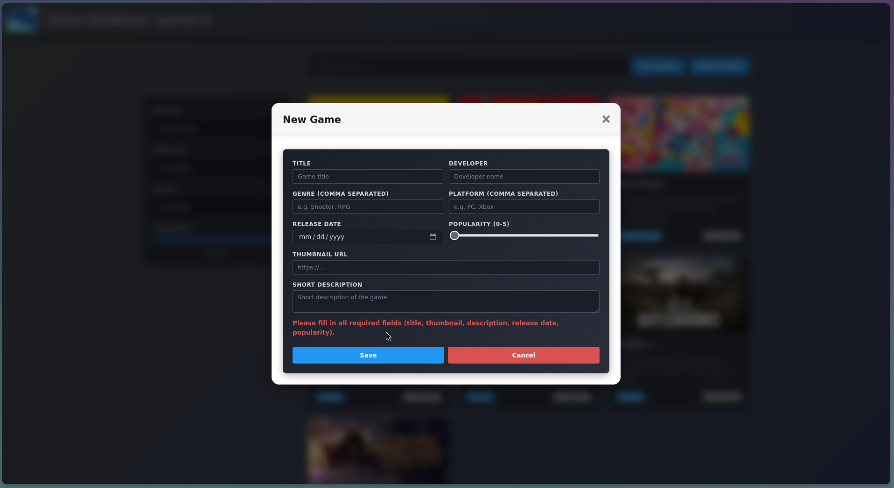
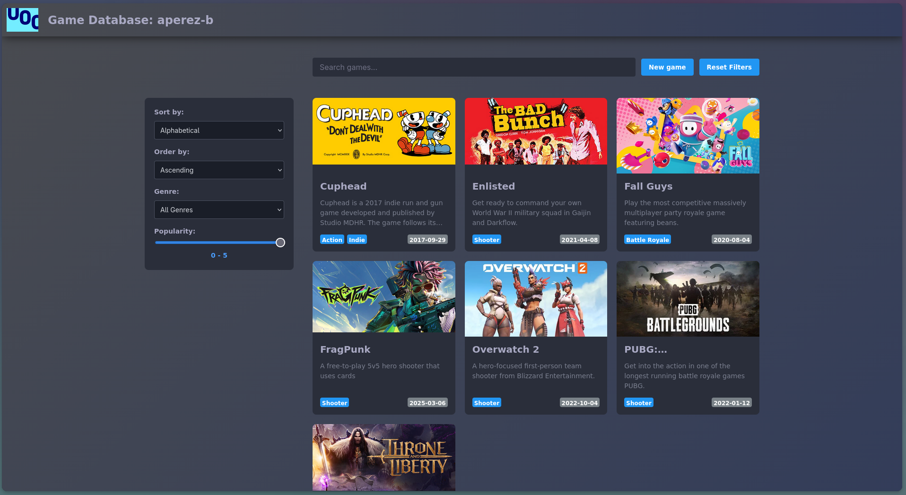
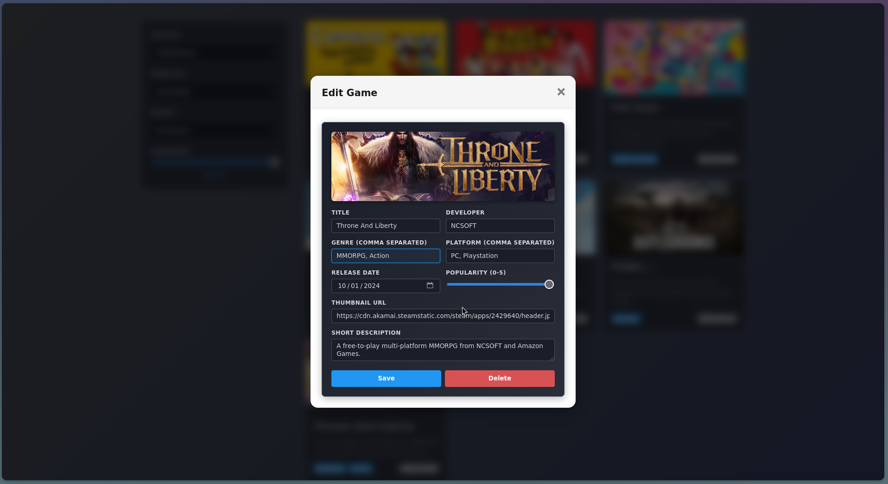
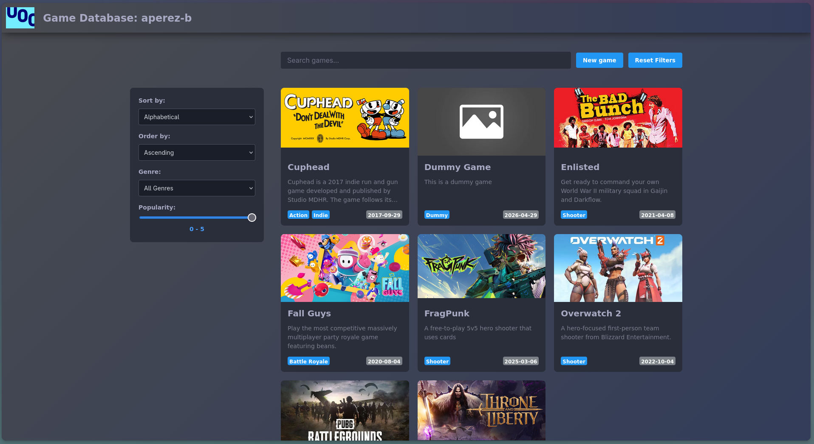
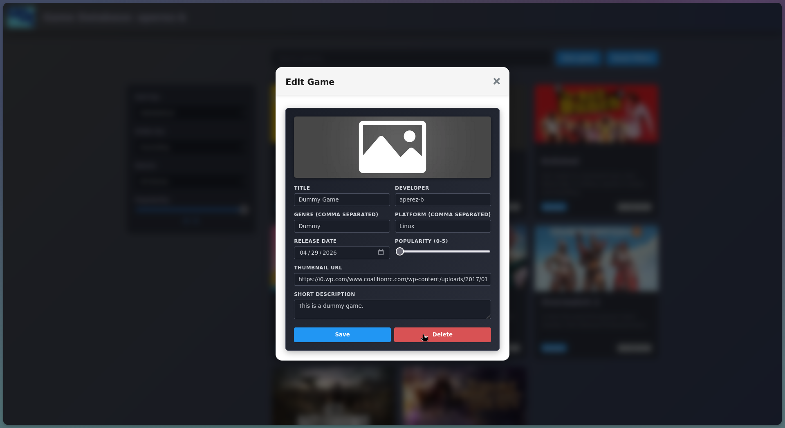



## Exercise 1

Vue components follow a lifecycle that includes initialization steps such as data obsevation setup, template compilation, DOM mounting and DOM updates on data changes [@vue_lifecycle]. The framework runs lifecycle hooks during this process. These hooks let developers add code at set points. Vue hooks integrate with its reactivity system, though they resemble native Web Components [@azaustre2024].

Here are three liifecycle stages:

The **created** hook runs after instance setup. The reactivity system, data, computed properties and methods work at this point. The template remains uncompiled and no DOM attachment occurs. Use it for async tasks like API calls [@vue_lifecycle].

Once initial rendering finishes and nodes are in the document, the **mounted** hook triggers. Code needing direct DOM interaction belongs here such as tracking elements or setting up libraries [@vue_lifecycle].

The **unmounted** hook (called **destroyed** in Vue 2) executes on component removal from the DOM. It clears resources such as timers, subscriptions and event listeners to avoid leaks [@vue_lifecycle].

## Exercise 2

Mounting the `CounterDisplay` component executes the `mounted()` lifecycle hook following DOM insertion. The `this.count++` statement then triess to modify the inherited `count` proeprty. Vue responds by generating a console warning about prop. mutation. The local instance may show the new value, but the framework restricts this modification from altering the source.

Because of this the parent component observes no changes. Vue uses a one-way data flow model where properties move exclusively from parent to child [@vue_props_flow]. This structureallows for predictable application state. Child components treat received props as read-only and lack permission to override parent ownership. Direct prop modification violates this design,as components must emit events to request updates rather than changing values internally. The parent receives the event, executes the mutation, and passes the updated value. The `mounted()` logic bypasses this required communication cycle, which triggers the warning and preserves the parent data [@vue_props_flow].

## Exercise 3

This `<Tekeport>` component renders content outside its parent in the DOM tree. The internal Vue context remains unchanged, including state, props and reactivity [@logrocket_teleport].

### Component Example

```vue
<template>
  <Teleport to="body">
    <div v-if="isOpen" class="modal-overlay">
      <div class="modal-content">
        <h2>Important Notification</h2>
        <p>This modal comtent is rendered outside its parent component.</p>
        <button @click="isOpen = false">Close Modal</button>
      </div>
    </div>
  </Teleport>
</template>

<script>
import { ref } from 'vue';

export default {
  setup() {
    const isOpen = ref(false);

    const open = () => {
      isOpen.value = true;
    };

    return {
      isOpen,
      open,
    };
  },
};
</script>
```

This component addresses issues from component nesting, because elements like modals require position above other content. They must avoid parent CSS constraints like `overflow: hidden`. Without `<Teleport>`, state synchronization with global elements becomes complex [@logrocket_teleport].

Content avoids inheritance of parent styles or clipping at boundaries. Rendering occurs at the root or `<body>`, which provides a new context.

The component stays nested for data and logic and rendred output appears globally, which separates logical structure from visual placement.

## Exercise 3

### a)

`sumA` acts as a computed property that derives its value from `items`. `total` serves as a reactive reference updated through a watch effect.

`sumA` follows a declarative approach. Vue caches its result, recomputing only on changes to `items`. Access uses `sumA.value` [@vue_computed_vs_watch].

`total` follows an imperative approach. A watch effect calculates and assigns the sum to `total` on `items` changes. `total` remains mutable as a ref.

`sumA` suits derived values from reactive state. `total` suits values updated by watching state changes.

### b)

Use Option A for derving state from reactive data like `items`, for read-heavy use with infrequent changes or for synchronous calculations.

Use Option B for side effects such as DOM changes, API requests, for logging on state changes or for updating separate reactive values with async logic.

### c)

| Feature          | Option A                                               | Option B                                            |
|------------------|------------------------------------------------------- |-----------------------------------------------------|
| Performance      | Caches value; recomputes on dependency changes only.   | Runs on every source change; no caching.            |
| Clarity          | Shows value derivation from data.                      | Fits effects; less clear for simple derivations.    |
| Flexibility      | Synchronous returns only.                              | Handles async operations.                           |
| Mutability       | Read-only by default.                                  | Mutable ref.                                        |

Given tge following access pattern:

- Initial Load: Both sumA and total are calculated.
- Access sumA 5 times: sumA.value returns the cached value 5 times. No calculation is performed after the first read.
- Access total 5 times: total.value reads the stored value from the ref.

If items has not changed since the initial load sumA is more efficient as it leverages caching. The array reduction only happens once. total is equally efficient for reading its stored value, but the overall approach in Option A is preferred for derived state because it manages the calculation lifecycle automatically and optimally.

A clear example where the watch (Option B) approach is necessary is when the sum calculation needs to trigger a server request:

```vue
watch(total, (newTotal) => {
  if (newTotal > 100) {
    // This is a side effect and must be done in a watcher
    alert('Total exceeded 100! Sending notification to server...');
    // await axios.post('/api/total-exceeded', { newTotal }) 
  }
});
```

## Project

:::{.callout-note}

The code for this assignment can be found [here](./project/src/.).

:::

Here are some screenshots showing some of the requested features in action:

::: {#fig-modal layout-ncol=2}

{#fig-invalid-params}

{#fig-cuphead}

Process of adding the game Cuphead to the app
:::


::: {#fig-edit-game layout-ncol=2}

{#fig-action-genre}

{#fig-updated-genre}

Process of adding the "Action" genre to the game "Throne and Librety"
:::

::: {#fig-delete-game layout-ncol=2}

{#fig-dummy-created}

{#fig-dummy-deleted}

Process of deleting a sample game from the library
:::



## References

::: {#refs}
:::
