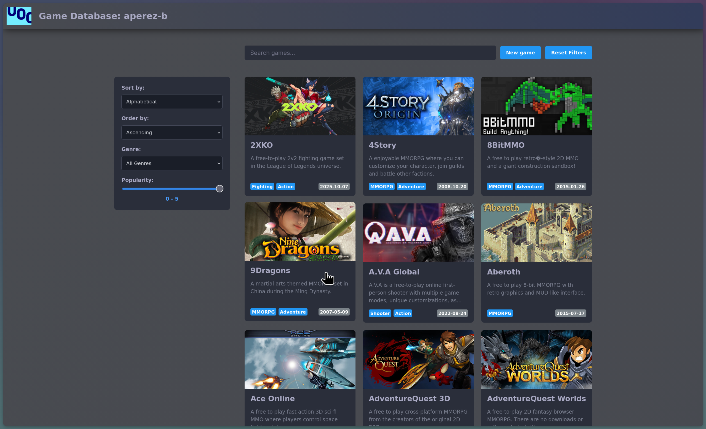
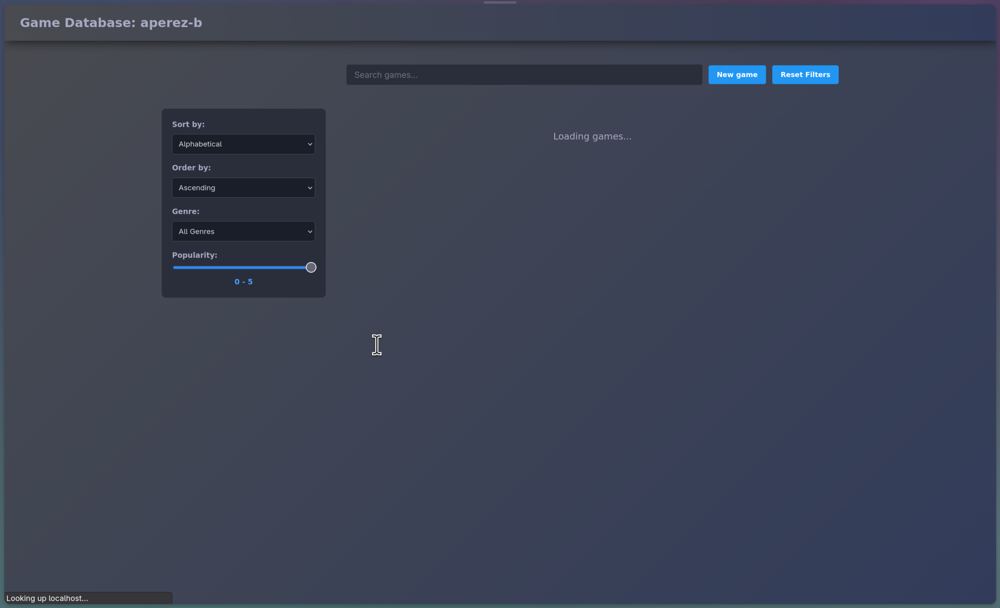
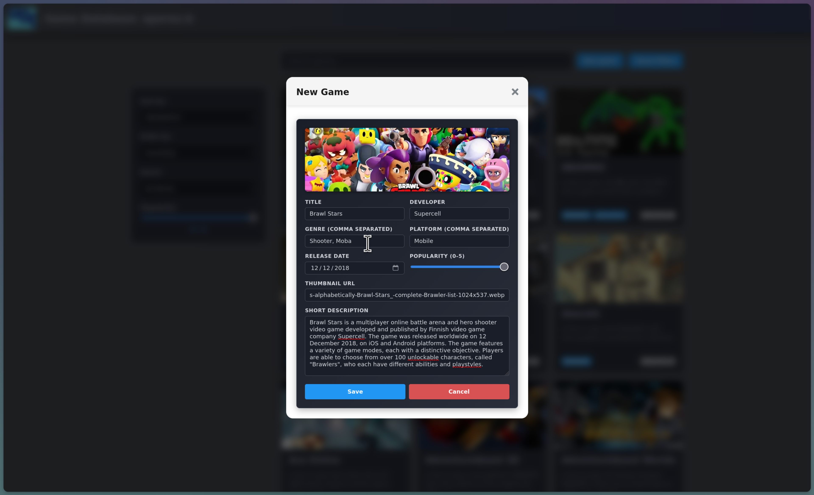
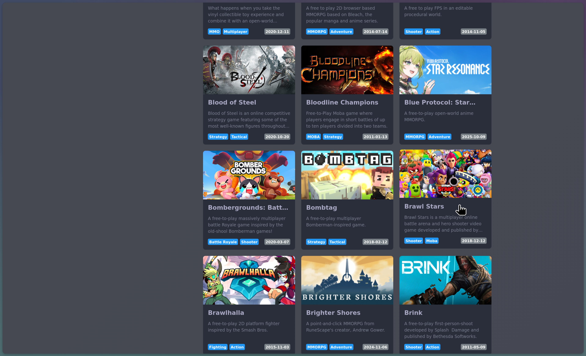
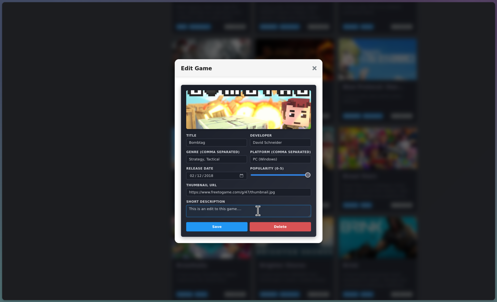
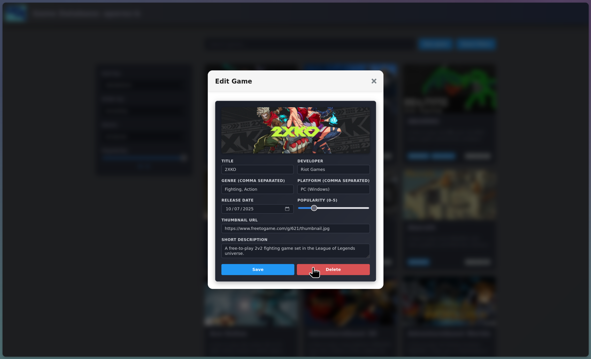
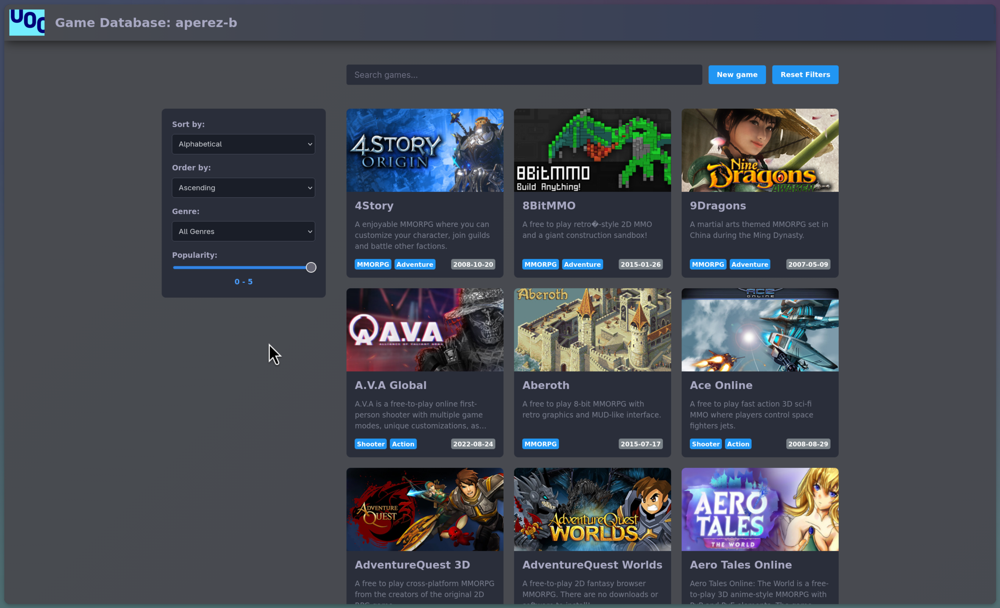



## Exercise 1

An API (Application Programming Interface) is basically a set of rules that defines how two pieces of software can talk to each other. In web development, APIs expose endpoints over HTTP that accept requests and return structured data, typically JSON [@azaustre2024, Chapter 5]. The front-end sends requests using methods like GET, POST, PUT or DELETE, and the server processes them and responds accordingly.

APIs are crucial because they decouple the front-end from the back-end. The client does not need to know how the server stores or manages data interally, it only needs the URL and the expected format. Both sides can be developed and deployed independently wich is how most real-world applications work [@azaustre2024, Chapter 5].

A library or framework like Vue.js is code you import and run inside your application to build user interfaces. An API on the other hand is not code you embed, it is an external service you communicate with over the network. They complement each other: Vue handles the presentaton layer while APIs provide the data. Vue can use the Fetch API or a library like Axios to make HTTP requests, receive the JSON and render it reactively [@azaustre2024, Chapter 5].

Three web APIs that could be integrated into a web application:

- **OpenWeatherMap API** [@openweathermap]. Provides current weather, forecasts and historical data for any location. A web app could use geolocation to fetch the user's local weather and display temperature, humidity and conditions. Useful for a travel planner or a dashboard homepage.

- **Spotify Web API.** This one exposes endpoints for searching tracks, retrieving playlists and reading user listening history [@spotify_api]. A music discovery app built with Vue could let users search songs, preview tracks and build playlists. It also gives audio features like tempo and energy per track wich could be used to create mood-based recommendations.

- **GitHub REST API.** Gives access to repositories, commits, issues and user profiles [@github_api]. You could build a developer portfolio site that pulls public repos and displays stats like stars, forks and languages used. The portfolio stays up to date automaticaly without manual maintenance.

## Exercise 2

### 1)

On the first render `post` is `null` because the `onMounted` callback has not run yet. The template tries to access `post.title` which evaluates to `undefined` since `null` does not have properties. Vue handles this gracefully so the `<p>` tag just renders empty with no visible text [@vue_lifecycle]. The user sees a blank paragrpah until the fetch resolves and `post.value` gets updated.

### 2)

The user just sees nothing while the request is pending which is bad UX. We can add a reactive boolean that tracks if data is still being fetched and use `v-if` / `v-else` to show a loading messsage:

```vue
<script setup>
import { ref, onMounted } from 'vue'

const post = ref(null)
const loading = ref(true)

onMounted(async () => {
  const res = await fetch('https://jsonplaceholder.typicode.com/posts/1')
  post.value = await res.json()
  loading.value = false
})
</script>

<template>
  <p v-if="loading">Loading post...</p>
  <p v-else>{{ post.title }}</p>
</template>
```

This way the user sees tge loading screen right away and knows something is happening. Once the response arrives and `loading` is set to `false`the directives swap the content.

### 3)

The original code has no error handling at all. If the network fails or the server returns an error the app just silently breaks. We wrap the fetch in `try/catch` and also check `response.ok` since the Fetch API does not reject the promise on HTTP errors by itself [@azaustre2024, Chapter 5; @mdn_fetch]:

```vue
<script setup>
import { ref, onMounted } from 'vue'

const post = ref(null)
const loading = ref(true)
const error = ref(null)

onMounted(async () => {
  try {
    const res = await fetch('https://jsonplaceholder.typicode.com/posts/1')
    if (!res.ok) {
      throw new Error('Server responded with status ' + res.status)
    }
    post.value = await res.json()
  } catch (err) {
    error.value = err.message
  } finally {
    loading.value = false
  }
})
</script>

<template>
  <p v-if="loading">Loading post...</p>
  <p v-else-if="error" class="error">Something went wrong: {{ error }}</p>
  <p v-else>{{ post.title }}</p>
</template>
```

The `try` block checks `response.ok` first to catch non-2xx status codes. Network failures like a lost connection get caught by the `catch` block. The `finally` block clears the loading state regardless of the outcome and on the template side `v-if` / `v-else-if` / `v-else` gives feedback for each posible state.

## Exercise 3

Vue 3 SFCs let you use reactive variables directly inside the `<style>` tag using the `v-bind()` CSS function [@vue_css_features]. It links a CSS property value to component state and Vue compiles it into a CSS custom property that gets reactvely updated when the source value changes.

A scenario where this is useful is a theme customization component where the user picks a color and the styles update instantly without having to manipulate classes or inline styles manually. It keeps the styling inside the `<style>` block where it belongs instead of scattering `:style` bindings across the template.

```vue
<script setup>
import { ref } from 'vue'

const themeColor = ref('#3498db')
</script>

<template>
  <div class="card">
    <h2>User Profile</h2>
    <p>Pick a theme color for this card:</p>
    <input type="color" v-model="themeColor" />
  </div>
</template>

<style scoped>
.card {
  border: 2px solid v-bind(themeColor);
  border-radius: 8px;
  padding: 1rem;
  background-color: #fff;
}

.card h2 {
  color: v-bind(themeColor);
}
</style>
```

When `themeColor` changes through the color picker Vue updates the underlying CSS custom property and the border and heading color change reactively. The CSS itself stays static in the compiled output, only the custom property value gets swapped at runtime via inline styles on the component root element [@vue_css_features]. For nested object properties the expression needs to be wrapped in quotes, like `v-bind('theme.color')`.

## Project

:::{.callout-note}

The code for this assignment can be found [here](./project/src/.).

:::

Here are some screenshots showing the application interacting with the API:

{#fig-game-list}

{#fig-loading}

::: {#fig-add-game layout-ncol=2}

{#fig-new-form}

{#fig-created}

Process of adding the game Brawl Stars to the database via POST request
:::

::: {#fig-edit-game layout-ncol=2}

{#fig-edit-form}

{#fig-delete-btn}

Editing and deleting games via PUT and DELETE requests
:::

{#fig-after-delete}



## References

::: {#refs}
:::
